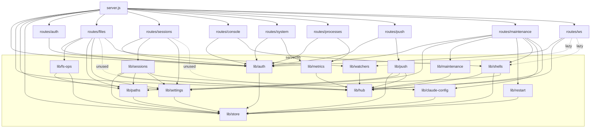

# Supervisor — Architecture Reference

> Phase A deliverable for `SUPERVISOR-ENGINEERING-PROMPT.md` §1. This document describes the
> code **as it actually is** at the time of writing, read directly from source. Where an
> earlier brief, `CLAUDE.md`, or `AUDIT.md` contradicts the code, the code wins and the
> discrepancy is called out inline. Every non-obvious claim cites `file:line`.
>
> Scope read: all of `server/**`, `web/app.js`, `web/views/*.js`, `web/components/*.js`,
> `web/styles.css`, `web/manifest.webmanifest`, plus `CLAUDE.md`, `AUDIT.md`, and
> `docs/updates/UPDATE-*.md`. Vendored assets (`web/vendor/**`), `web.new/**`, and
> `node_modules/**` were excluded per the brief.

---

## 0. One-paragraph model

Supervisor is a single-process Node/Express + `ws` server (`server/server.js`) that serves a
zero-build vanilla-JS PWA out of `web/`. One password guards everything; auth is an
HMAC-signed cookie (`server/lib/auth.js`). REST routes under `/api/*` are thin wrappers over
`server/lib/*` modules that own all state. Every live update — session logs, shell bytes,
metrics ticks, file-watcher events, settings changes — is published to a single in-process
`EventEmitter` (`server/lib/hub.js`) and fanned out to **every** connected WebSocket client by
`server/routes/ws.js`. Persistence is a handful of small JSON/binary files under `data/`
written atomically by `server/lib/store.js`. There is no database, no test suite, and no
build step.

---

## 1. Request lifecycle

### 1.1 Authenticated REST call

Trace of e.g. `GET /api/files/list?path=/home/user`:

1. **`.env` + boot (once, at process start).** `server.js:16-31` loads `.env`, *overriding*
   real env vars (documented footgun). `ensureDataDir()`, `auth.ensureInitialPassword()`, and
   `settings.get()` run before any route is mounted (`server.js:42-44`). A PID file is written
   (`server.js:48-49`) for `start.bat`'s stale-process kill.

2. **Express app config.** `app.disable('x-powered-by')` and `app.set('trust proxy', …)`
   (`server.js:89`). On committed `HEAD` this was unconditionally `true`, which let a client
   spoof `req.ip` via `X-Forwarded-For` and bypass the per-IP rate limit (`AUDIT` §1.1, HIGH-1);
   the security pass (§1.1 note) now gates it behind `SUPERVISOR_TRUST_PROXY=1`, defaulting to
   the raw socket address. A CSP and forced-default-password-change middleware are also added
   around here.

3. **Static-first middleware order.** `/vendor` (`server.js:62`), `/manifest.webmanifest`,
   `/sw.js`, `/icons/:name`, `/login`, and `/` are registered **before** the API routers.
   `GET /` and the SPA fallback (`server.js:86-91`, `131-136`) do a cookie check via
   `auth.readToken` + `auth.verify` and redirect to `/login` when unauthenticated; the app
   shell itself is served without auth (auth happens on the in-app `fetch`/WS calls).

4. **Router mount.** `/api/auth` is always mounted (`server.js:104`). All other feature
   routers are mounted through `tryMount()` (`server.js:108-125`), which silently skips a
   router whose file is missing (`ENOENT` only). Real `require` errors inside an existing route
   file still surface.

5. **Per-router auth gate.** Every feature router installs `router.use(auth.requireAuth)` as
   its first middleware (e.g. `routes/files.js:18`, `sessions.js:8`, `console.js:6`). Only
   `/api/auth` is partly public (`/login`, `/logout`, `/me`; `change-password` is itself gated,
   `routes/auth.js:43`).

6. **`auth.requireAuth`** (`auth.js:240-248`): reads the token via `readToken`, then `verify`.
   - `readToken` (`auth.js:222-238`) checks, in order: the `sup_sess` cookie, an
     `Authorization: Bearer` header, then — **only when called with `{allowQuery:true}`** — a
     `?token=` query param. `requireAuth` calls it without that flag, so ordinary routes reject
     the query token; only the WS upgrade (`routes/ws.js:16`) passes `allowQuery:true`. This
     closes `AUDIT` MED-4. (On committed `HEAD` the query param was accepted on every route.)
   - `verify` (`auth.js:98-118`): splits `body.sig`, recomputes HMAC-SHA256 over `body` with the
     key from `secret.bin`, constant-time compares, JSON-parses the payload, rejects if `exp` is
     missing/past, and rejects if the token's `ver` epoch ≠ the current `getEpoch()`. Tokens are
     **stateless** (no server-side session store), but revocation now works via two mechanisms:
     `change-password` and `logout` both call `auth.rotateAuth()` (`routes/auth.js:47,65`), which
     rotates `secret.bin` **and** bumps the epoch, instantly invalidating every outstanding
     cookie (closing `AUDIT` HIGH-2). Absent a rotation, a cookie lives until `exp` (12 h, or 60
     days for a "trusted device", `auth.js:17-18`).
   - On success `req.session = payload` and `next()`; on failure `401 {error:'unauthorized'}`.

> **Live security-hardening pass (verify against `git status`).** While this doc was being
> written, a concurrent change was actively landing across `server/lib/auth.js`,
> `server/routes/auth.js`, `server/routes/ws.js`, and `server/server.js` that closes most of the
> `AUDIT` §2 CRIT/HIGH items. As captured here it includes: a strict `Content-Security-Policy`
> header (`server.js:79`); `trust proxy` gated behind `SUPERVISOR_TRUST_PROXY=1` (`server.js:89`,
> closing HIGH-1); a forced-first-password-change middleware that blocks routes while the
> credential is still the default (`server.js:146`, `auth.isDefaultPassword()`); a refusal to
> bind non-loopback with the default password (`server.js:197`, CRIT-3); scrypt `N` raised to
> 32768 with per-hash params (`auth.js:11,69-97`); a token-`ver` epoch + `secret.bin` rotation on
> `change-password`/`logout` (HIGH-2); a global sliding-window rate-limit ceiling on top of the
> per-IP backoff (`auth.js:151-215`, HIGH-1); and the `allowQuery` gate above (MED-4). These
> files are **being edited by another process concurrently with this document**, so their exact
> line numbers are volatile — prefer the function names when navigating. This Phase A change did
> **not** author those edits (this deliverable adds only `docs/ARCHITECTURE.md`); they are noted
> here for accuracy.

7. **Body parsing.** Each router installs its own `express.json({limit})` with route-specific
   caps (files 50 MB `files.js:20`, sessions 1 MB, console 256 KB, push 64 KB). `files.js`
   adds a JSON error→400 shim (`files.js:23-26`).

8. **Handler → lib.** The handler validates inputs and calls into a `lib/*` module. For files,
   `ensureSafe(p)` (`paths.js:45-53`) is called on every path first: it `path.resolve`s the
   input and rejects (`EBLOCKED`) if the resolved path equals or is prefixed by any blocklist
   entry (`paths.js:35-43`). This guard is **string-prefix only** — it does not call
   `fs.realpath`, so a symlink inside an allowed dir escapes it, and it does **not** protect the
   app's own `data/` directory (`AUDIT` §1.2, MED-1/MED-3). `fs-ops.listDir` (`fs-ops.js:23-53`)
   then reads the directory and returns entries.

9. **Response + error mapping.** Handlers return JSON. `files.js`'s `handle()` wrapper
   (`files.js:30-45`) maps error codes to HTTP status: `EBLOCKED`→403, `ENOENT`→404,
   `EACCES/EPERM`→403, `EEXIST`→409, else `e.status||500`. The client's `window.api`
   (`util.js:73-94`) treats any `401` as "re-auth" and hard-redirects to `/login`.

### 1.2 WebSocket message

Single socket at `/ws`, set up in `routes/ws.js` via `server.on('upgrade')`.

1. **Upgrade auth** (`ws.js:11-25`): rejects any path not starting with `/ws`
   (`socket.destroy()`); otherwise `auth.readToken(req)` (here the `?token=` query param is the
   normal transport, since browsers can't set WS headers) + `auth.verify`. On failure it writes
   a raw `HTTP/1.1 401` and destroys the socket. On success `wss.handleUpgrade` promotes it and
   emits `connection`.

2. **Connection setup** (`ws.js:43-45`): `ws.subs = new Set()` is created and a
   `{topic:'hello'}` frame is sent. The client (`app.js:141-170`) opens the socket with
   exponential backoff (500 ms → 15 s), re-subscribes all `App.wsTopics` on reconnect
   (`app.js:152`), and starts a ping loop.

3. **Client → server messages** (`ws.js:62-80`), parsed as JSON:
   - `{type:'sub', topic}` → `handleSub` (`ws.js:47-53`): adds to `ws.subs`; if the topic starts
     with `files:`, ref-counts a chokidar watcher via `watchers.addSubscriber` (lazy-required).
   - `{type:'unsub', topic}` → `handleUnsub` (`ws.js:54-60`): removes from `ws.subs`; for
     `files:` topics decrements the watcher ref-count.
   - `{type:'ping'}` → immediate `{topic:'pong'}` reply (`ws.js:69`). The client measures RTT
     and renders a latency badge (`app.js:172-219`); server has **no** heartbeat of its own, so
     half-open sockets linger (`AUDIT` §1.3, WS backpressure).
   - **Hot path — `{type:'shell:write', id, data}`** (`ws.js:71-74`): calls
     `shells.write(id, data)` directly. Keystrokes bypass HTTP entirely; this is the latency-
     critical terminal path.
   - **`{type:'shell:resize', id, cols, rows}`** (`ws.js:75-78`): `shells.resize`.
   - Anything else falls through to an optional `onMessage` hook (unused in production;
     `setup()` is called with no options at `server.js:141`).

4. **Server → client broadcast** (`ws.js:27-35`): `hub.on('msg', broadcast)` wires the hub's
   firehose to `broadcast()`, which JSON-stringifies once and sends to **every**
   `wss.clients` member with `readyState === 1`. See §2.3 for why `ws.subs` is ignored here.

5. **Close** (`ws.js:82-87`): `watchers.removeAllForWs(ws)` tears down this socket's watcher
   references, then `hub.emit('ws:close', ws)`.

---

## 2. State flow and cache-invalidation seams

### 2.1 The happy path

```
lib module mutates state
   → hub.publish(topic, payload)          lib/hub.js:12-16
       emits 'msg' {topic,payload,t}       → routes/ws.js broadcast()  (ws.js:27-35)
       emits '<topic>' payload             → in-process listeners (push.js, maintenance handoff)
           → ws.send() to every client
               → App WebSocket 'message'   web/app.js:162-167
                   → each App.wsHandlers(msg)
                       → the active view's handler re-renders
```

`hub.publish` (`hub.js:12-16`) fires **two** emits: a generic `'msg'` envelope consumed by the
WS broadcaster, and a **topic-named** event consumed by in-process server-side listeners
(`push.js:68` listens on `'notify'`; `routes/maintenance.js:101` listens on `shell:<id>` for the
auto-paste). This dual-emit is deliberate and load-bearing.

On the client, `App.onMessage(handler)` (`app.js:232-235`) registers a handler in the
`App.wsHandlers` set; views call `App.subscribe(topic)` (`app.js:224-227`) to add a topic to
`App.wsTopics` and send a `sub` frame. Because the server ignores subscriptions for delivery
(§2.3), `subscribe` is effectively only meaningful for `files:` topics (it starts the watcher)
and for re-subscription bookkeeping across reconnects — every client receives every topic
regardless. Views filter by inspecting `msg.topic` inside their handler.

Topic namespace (from `hub.publish` call sites): `sessions`, `session:<id>`, `shells`,
`shell:<id>`, `files:<resolved-abs-path>`, `system`, `settings`, `maintenance`, `notify`,
`server`, plus the non-`msg` internal event `ws:close`.

### 2.2 Cache-invalidation seams

| Seam | Where | Staleness risk |
|---|---|---|
| **Settings read-through cache** | `lib/settings.js:27-56`. `load()` memoizes `cache`; `update()`/`reset()` mutate `cache` **and** write disk, so the in-process cache stays coherent. | `paths.js:24` and `paths.js:75` read `settings.json` **directly from disk** via `readJSON`, bypassing the settings cache. A settings change made through `settings.update()` is written to disk before returning, so this is usually consistent — but any code that mutates the cache without writing (there is none today) would desync. Conversely a manual edit of `settings.json` on disk is invisible to the cache until restart. |
| **Client settings apply** | `app.js:254-264` `applySettings`; live via the `settings` WS topic (`app.js:409-411`) published by `routes/settings.js:16,22,40`. | A settings mutation that does **not** publish `settings` (none in current routes) would leave open tabs stale. |
| **Session/shell metadata** | In-memory `Map`s in `sessions.js:17` / `shells.js:18` are the source of truth; JSON files are snapshots. | `sessions.persistMeta` runs on lifecycle events; `shells.persistMeta` likewise. The `lastLog`/`scrollback` on disk are **tails**, not full history — a viewer opened after restart sees only the persisted tail (`sessions.js:15` `LOG_TAIL_KEEP=256KB`; `shells.js:14` 10 MB cap). |
| **Metrics history ring** | `metrics.js:369` `history` (60-sample ring). | Rebuilt fresh each boot; a reconnecting client gets whatever the ring currently holds via the next `system` tick, not a full backfill. |
| **Disks / GPU caches** | `metrics.js:149-158` (30 s disks TTL), `metrics.js:248-253` (30 s GPU TTL, plus permanent `gpuMissing` skip after one failure). | Disk/GPU changes lag up to 30 s; once `nvidia-smi` fails once, GPU is reported `null` for the process lifetime (`metrics.js:257`). |

### 2.3 Known flaw: WS broadcasts everything to everyone

**Confirmed in code.** `routes/ws.js:35` wires `hub.on('msg', broadcast)`, and `broadcast()`
(`ws.js:27-32`) iterates `wss.clients` and sends to **all** of them. `ws.subs` is populated by
`handleSub`/`handleUnsub` (`ws.js:47-60`) but is **never read** during delivery — its only real
consumers are (a) the `files:` branch that ref-counts chokidar watchers and (b)
`removeAllForWs` cleanup. Consequences: every open tab receives every session's log stream,
every shell's byte output, every 2.5 s metrics snapshot, and every watched directory's events,
regardless of what that tab is showing. This is both a bandwidth cost and a blast-radius/secret-
leak concern (a Files tab receives another session's Claude output). Fixing it (filter by
`ws.subs`) is tracked as `AUDIT` HIGH-3 / `UPDATE-1.2`; **do not build features that rely on the
broadcast-all behavior.**

---

## 3. Claude session lifecycle

Owned by `lib/sessions.js`; driven by `routes/sessions.js`.

### 3.1 Create — `POST /api/sessions`

1. `routes/sessions.js:37-48` validates `folder` and calls `sessions.start({folder, args, env,
   prePrompt, name, tag, command})`.
2. `start()` (`sessions.js:126-197`):
   - `ensureSafe(folder)` + existence check (`sessions.js:127-128`).
   - **Trust-dialog dance** (`sessions.js:135-137`): if `autoTrustClaudeFolders !== false`,
     `await claudeConfig.trustFolderInteractive(folder)`. See §3.2.
   - Resolves the command: default `cmd='claude'`, `cmdArgs=['rc']` unless `args` supplied
     (`sessions.js:141-144`). Note the redundant reassignment at `142` then `144`.
   - **Spawn** (`sessions.js:149`): `spawn(cmd, cmdArgs, {cwd: folder, shell:true, env})`.
     `shell:true` is used on **all** platforms. On POSIX this wraps the process in `/bin/sh -c`,
     which is the source of the "Kill doesn't kill the grandchild" orphan bug (brief §3.3 P-2):
     `kill('SIGTERM')` later targets the `sh` wrapper, not `claude`.
   - Builds `meta` (`sessions.js:154-160`, status `'running'`), stores
     `{meta, proc, logBuf:'', _lastPersist:0}` in the `sessions` Map.
3. Returns `get(id)` (metadata + full in-memory `logBuf`, `proc` stripped).

### 3.2 The trust-dialog dance — `claude-config.js`

**Why it exists** (`claude-config.js:1-11`): `claude rc` (Remote Control) performs its own
workspace-trust check and will **not** honor a pre-written `~/.claude.json`
`hasTrustDialogAccepted`. The only thing that actually satisfies it is answering the interactive
trust prompt in a real PTY. So `trustFolderInteractive(folder)` (`claude-config.js:72-121`):
- Returns early if `pty` failed to load (`node-pty` optional, `claude-config.js:19-20`) or the
  folder is already cached (`data/claude-trusted.json`, `claude-config.js:39-51`).
- `pty.spawn`s an interactive `claude` (`sh -c claude` / `cmd /c claude`,
  `claude-config.js:81-86`), scrapes output through `stripAnsi` (`claude-config.js:64-69`, which
  converts cursor-right escapes to spaces so `"Yes, I trust this folder"` is matchable), and on
  matching the trust prompt writes `\r` to accept the default, waits 1.2 s for persistence,
  caches the folder, and kills the PTY (`claude-config.js:98-113`). Hard timeout 8 s.

**Failure mode (brief §3.3 P-4):** when `node-pty` is not built, this returns `{ok:false}`
forever, the trust dialog is never accepted, and a new session spawned in an un-trusted folder
hangs on an unanswerable prompt while still showing `running`. `sessions.js:136` swallows the
result in an empty `catch`, so the failure is invisible.

### 3.3 Streaming, log ring, disk persistence

- `proc.stdout`/`proc.stderr` `data` → `appendLog(id, chunk)` (`sessions.js:164-165`).
- `appendLog` (`sessions.js:62-76`): concatenates into `logBuf`, trims to a 10 MB in-memory ring
  (`MAX_LOG_BYTES`, `sessions.js:14`), and **throttles disk writes to once per second**
  (`sessions.js:69-72`), persisting only the last 256 KB tail to `data/session-logs/<id>.log`.
  It then `hub.publish('session:<id>', {event:'log', chunk})` and runs `detectIntent`.

### 3.4 stdout scraping — `detectIntent`

`detectIntent` (`sessions.js:78-86`) lowercases each chunk and, if it contains `"do you want"`
or matches `/\?\s*(\(y\/n\)|\(yes\/no\))/`, and 5 s have passed since the last notification,
fires `fireNotification('asked', s)`. This is admittedly fragile stdout scraping (`AUDIT` §1.4;
`UPDATE-1.6` proposes structured `stream-json`).

### 3.5 Notify → push bridge

`fireNotification(kind, s)` (`sessions.js:88-97`) `hub.publish('notify', {kind, sessionId,
folder, name, status, when})` with `kind ∈ {finished, asked, error}`. `lib/push.js:68-99`
listens on the `'notify'` hub channel, maps the kind to a title/body/tag/url gated by
`settings.notifications`, and `broadcast()`s a Web Push to all stored subscriptions
(`data/push-subs.json`) via VAPID (`push.js:45-65`). Dead subscriptions (410/404) are pruned
(`push.js:51-54`). **The `notify` event also rides the generic `'msg'` firehose to WS clients,
but no browser code consumes the `notify` topic** (verified: no `notify` handler in `web/`) —
see §7.

### 3.6 Process exit

`proc.on('exit')` (`sessions.js:167-176`): sets status (`'killed'` if signal was `SIGTERM`, else
`exited (code N|signal)`), appends a marker line, publishes `session:<id>` status +
`sessions changed`, fires a `finished`/`error` notification based on exit code, and
`persistMeta()`. `proc.on('error')` (`sessions.js:177-183`) sets an `error:` status and notifies.

### 3.7 Kill / clear / restart

- `kill(id)` (`sessions.js:206-232`): Windows uses `taskkill /pid /f /t`; POSIX
  `proc.kill('SIGTERM')` (which hits the `sh` wrapper — P-2). Sets status `'killing'`, publishes,
  and arms a **5 s safety-net timer** (`sessions.js:221-229`) to force-mark `'killed'` if the
  real exit event never arrives (a real hazard with `shell:true`).
- `clear(id)` (`sessions.js:254-271`): force-kills if still alive, deletes the Map entry and log
  file immediately, publishes `sessions removed`. `clearAllExited` (`sessions.js:273-286`) sweeps
  all non-running sessions.
- `restart(id)` (`sessions.js:234-249`): kills if running, then `start()`s a fresh session
  reusing `folder/args/env/prePrompt/name/tag/command`.
- `setName(id, name, tag)` (`sessions.js:288-296`) renames/tags.

### 3.8 `bootRestore()` on restart

`bootRestore()` (`sessions.js:298-314`) runs at module load (`sessions.js:328`). It reads
`sessions.json`, rewrites any `running`/`killing` status to `exited (supervisor restarted)`
(processes cannot be reattached across a restart), and rehydrates each into the Map with a
**fake dead proc** (`{killed:true, stdin:null}`) and the persisted log tail from disk. This is
why post-restart sessions render as terminated shells with their last log tail, not live.

`closeAll()` (`sessions.js:316-326`) kills live children on graceful shutdown
(`server.js:176`).

---

## 4. Shell lifecycle

Owned by `lib/shells.js`; driven by `routes/console.js` and the WS hot path.

1. **Create — `POST /api/console`** (`routes/console.js:17-22`) → `shells.create()`
   (`shells.js:168-176`) constructs a `Shell` and publishes `shells created`.
2. **Spawn** (`Shell._spawn`, `shells.js:56-83`): `ensureSafe(cwd)` (falls back to home on
   block, `shells.js:57`).
   - **PTY path** (`shells.js:60-68`) when `node-pty` loaded (`shells.js:11-12`): `pty.spawn`
     with `xterm-256color`, real cols/rows, `onData`/`onExit` wired.
   - **Piped fallback** (`shells.js:69-81`) when `node-pty` is unavailable: `cp.spawn` with
     stdio pipes, `TERM=dumb`, and a one-line banner warning the user there are no TTY features.
     `defaultShell()` (`shells.js:30-33`) is `COMSPEC`/`cmd.exe` on Windows, `$SHELL`/`/bin/bash`
     on POSIX.
3. **Output** (`Shell._onData`, `shells.js:85-89`): publishes `shell:<id> {event:'data', data}`
   and appends to an in-memory `scrollback` buffer.
4. **Scrollback ring → disk** (`shells.js:99-119`): `_appendScrollback` flushes to
   `data/shells/<id>.log` once the in-memory buffer exceeds 64 KB; `_flushScrollback` appends,
   tracks size, and rotates the file down to a 10 MB cap (`SCROLLBACK_MAX`, `shells.js:14`). A
   background `setInterval(flushAll, 5000)` (`shells.js:229`) flushes all shells periodically.
   `get(id)` returns the full on-disk scrollback (`shells.js:162-166`), so a reopened tab
   restores its history.
5. **Input hot path.** Keystrokes arrive over WS as `shell:write` (`ws.js:71-74`) →
   `shells.write` (`shells.js:178-181`) → `Shell.write` (`shells.js:121-126`), bypassing HTTP
   entirely. An HTTP `POST /:id/write` (`console.js:24-29`) also exists as a fallback.
6. **Resize** (`ws.js:75-78` or `console.js:31-35`) → `Shell.resize` (`shells.js:128-133`);
   only meaningful in the PTY path.
7. **Kill / destroy.** `Shell.kill` (`shells.js:135-144`): PTY `proc.kill()`; else Windows
   `taskkill /f /t`, else POSIX `proc.kill('SIGTERM')` — which, like sessions, kills only the
   shell process, not its child tree (brief §3.3 P-12). `_onExit` (`shells.js:91-97`) publishes
   `shell:<id> {event:'exit'}` + `shells changed`. `destroy(id)` (`shells.js:203-211`) kills,
   deletes the Map entry and scrollback file, publishes `shells removed`. `closeAll`
   (`shells.js:222-227`) flushes + kills on shutdown.

**Persistence note:** unlike sessions, there is **no `bootRestore` for shells** — `shells.json`
is written by `persistMeta` (`shells.js:213-216`) but never read back on boot. After a restart,
scrollback files survive on disk but the shell list starts empty. (Discrepancy worth flagging:
the metadata file is effectively write-only.)

---

## 5. Persisted state inventory (`data/`)

`data/` is gitignored runtime state. All JSON is written atomically (tmp + rename) by
`lib/store.js:26-48`; `shells.json`, `claude-trusted.json`, and session/shell logs are written
directly. Paths are relative to `store.js`'s `DATA_DIR` (`store.js:6`).

| Path | Written by | Contents | If deleted |
|---|---|---|---|
| `passwd.json` | `auth.setPassword` (`auth.js:134-137`) | scrypt `{salt, hash(, N,r,p,keylen)}` of the password | On next boot `ensureInitialPassword` (`auth.js:139-149`) re-seeds from `$SUPERVISOR_PASSWORD`, else the literal default `"supervisor"`. **Password reset to default/env.** |
| `secret.bin` | `auth.secret` (`auth.js:21-30`) | 64-byte HMAC cookie-signing key | Regenerated on next `secret()` call. **All existing session cookies become invalid** (every user is logged out). |
| `auth-state.json` (security-pass, see §1.1 note) | `auth.bumpEpoch` (`auth.js:44-48`) | `{epoch}` token-revocation counter, bumped by `rotateAuth` on password-change/logout | Epoch resets to 0. **Every currently-issued cookie whose `ver > 0` becomes invalid** (all such devices are logged out). |
| `vapid.json` | `push.loadVapid` (`push.js:11-19`) | VAPID `{publicKey, privateKey}` for Web Push | Regenerated. **All existing push subscriptions break** (they were bound to the old public key) and must be re-registered per device. |
| `push-subs.json` | `push.saveSubs` (`push.js:22-23`) | array of `{id, label, sub, when}` browser push subscriptions | **All devices stop receiving push notifications** until they re-subscribe. Falls back to `[]`. |
| `settings.json` | `settings.update/reset` (`settings.js:49-62`) | theme, accent, pins, recents, blocklist, presets, notification prefs, `selfRepoPath`, quick keys, etc. | Next `settings.get` returns `DEFAULTS` (`settings.js:5-25`). **All customization, presets, pins, and blocklist overrides lost;** blocklist reverts to platform defaults. |
| `sessions.json` | `sessions.saveAll` (`sessions.js:38`) | snapshot array of session metadata + `lastLog` tail | `bootRestore` finds nothing; **session history/list is empty after restart** (live in-memory sessions are unaffected until restart). |
| `shells.json` | `shells.persistMeta` (`shells.js:213-216`) | snapshot of shell metadata | No effect on running shells; and since it is never read on boot, deleting it changes nothing at restart either. |
| `claude-trusted.json` | `claude-config.saveCache` (`claude-config.js:34-37`) | `{folders:[...]}` of trust-accepted folders | Trust cache empties. **The ~3 s interactive trust dance re-runs on the next session per folder** (correctness-neutral, just slower; hangs if `node-pty` missing). |
| `session-logs/<id>.log` | `sessions.appendLog` (`sessions.js:71`) | last 256 KB tail per session | Losing one removes that session's restorable log tail; `bootRestore` falls back to the `lastLog` in `sessions.json` (`sessions.js:307-310`). |
| `shells/<id>.log` | `Shell._flushScrollback` (`shells.js:108`) | up to 10 MB scrollback per shell | That shell's scrollback history is lost; a live shell keeps streaming new output. |
| `trash/` (dir) + `trash/manifest.json` | `fs-ops.moveToTrash` etc. (`fs-ops.js:182-214`) | trashed files (renamed `<id>__name`) + manifest of `{id, originalPath, trashedPath, name, when}` | **Trash restore breaks.** Deleting the manifest orphans the files on disk (restore can't find them); deleting the files leaves dangling manifest entries whose restore 404s. Capped at 500 items (`fs-ops.js:208-211`). |
| `supervisor.pid` | `server.js:49` on boot, removed on shutdown (`server.js:173`) / restart (`restart.js:23`) | current PID | `start.bat`/`kill.bat` can't taskkill a stale process before rebinding the port. On a clean run, harmless. |

> Security note (`AUDIT` §1.2): `secret.bin`, `passwd.json`, and `vapid.json` all live under
> `data/`, which `ensureSafe` does **not** block, so an authenticated Files request can read or
> overwrite them today. Tracked as `UPDATE-1.1.2`.

---

## 6. Module dependency graph

Solid arrows = `require` at module load. The dashed arrows from `routes/ws.js` are the
**lazy** requires (`ws.js:38-41`, `getWatchers`/`getShells`) that defer loading `watchers` and
`shells` until the first WS message. The comment (`ws.js:37`) attributes this to avoiding a
boot-time circular dependency: `routes/ws.js` is required by `server.js` during HTTP/WS setup,
while `shells`/`sessions`/`watchers` all have **import-time side effects** (`shells.js:229`
starts an interval, `sessions.js:328` runs `bootRestore`, all three attach hub listeners). Lazy-
loading keeps `ws.js`'s own `require` graph acyclic and side-effect-free at the moment
`server.js` wires it up. `hub` is the shared leaf every live module depends on.



Note: `lib/store`, `lib/hub`, and `lib/paths` (aside from its `store` dep) are the dependency
sinks. No `lib/*` module requires a `routes/*` module — the layering is clean in that direction.

---

## 7. Dead / half-wired / self-contradicting inventory

Each item was re-verified against the code; `file:line` cited. Items are grouped by confidence.

### 7.1 Confirmed dead / half-wired

1. **`supervisor.js` — already deleted (brief is stale).** The brief, `CLAUDE.md`, and `AUDIT`
   all describe a dead unauthenticated RCE server at the repo root. **It no longer exists** —
   removed in git commit `b3679ab` ("security(CRIT-1): remove supervisor.js"). `package.json`
   `main` correctly points at `server/server.js`. *Discrepancy: the docs still reference it;
   CRIT-1 is effectively closed.*

2. **`maintenance.js` spawns `claude -p` WITHOUT `--dangerously-skip-permissions`.** The comment
   at `maintenance.js:60-61` claims "`-p` (print mode) plus `--dangerously-skip-permissions`
   lets it use Edit/Write tools without interactive permission prompts," but the actual spawn is
   `spawn('claude', ['-p'], …)` (`maintenance.js:74`) — the flag is absent. stdin is closed
   immediately after the prompt (`maintenance.js:92-95`), so any permission prompt can never be
   answered; the run stalls until… **nothing** — there is no timeout, so `state.status` stays
   `'running'`, `isBusy()` (`maintenance.js:42`) stays true, and `start()` throws `EBUSY`
   (`maintenance.js:45-47`) on every future request permanently. Comment contradicts code;
   correctness bug (brief §6, `AUDIT` §1.3).

3. **Two maintenance subsystems; only one is reachable from the UI.** The headless flow —
   `POST /request`, `GET /status`, `POST /cancel`, `POST /reset` (`routes/maintenance.js:17-50`)
   plus the `maintenance` WS topic (`maintenance.js:31-40`) — has **zero** frontend callers
   (verified: no `/api/maintenance/request|status|cancel|reset` and no `maintenance` topic
   handler anywhere in `web/`). The **only** live path is `POST /interactive`
   (`routes/maintenance.js:56-106`), invoked by `showMaintenanceModal` (`app.js:307`). The
   headless subsystem is fully built but dead. (`AUDIT`/brief §6.)

4. **`POST /api/maintenance/restart` has no frontend caller.** The endpoint exists
   (`routes/maintenance.js:108-115` → `restart.selfRestart`), but the only reference to it in
   `web/` is a comment (`app.js:339`). Nothing posts to it.

5. **`App.markRestarting()` is defined but never called.** `app.js:383-386` defines it (sets the
   `sessionStorage` flag and shows the restarting banner). The entire restart-banner state
   machine — `showRestartingBanner`/`showReloadBanner`/`checkRestartFlagOnReconnect`/
   `checkRestartFlagOnBoot` (`app.js:341-382`) — is complete, but nothing ever calls
   `markRestarting()`, so the "Server is restarting… → Reload now" banner has **no trigger**.
   (Tie-in: with #4, the client never initiates a self-restart at all.)

6. **`attachPullToRefresh` is defined and exported but never called.** `util.js:296-323` defines
   it, `util.js:347` exports it to `window`; **no caller** exists anywhere in `web/` (verified).

7. **`.rail-collapsed` CSS exists with no JS toggle.** `styles.css:230,259-260` (and the
   `--rail-collapsed-w` var, `styles.css:53`) style a collapsed sidebar rail, but **no JS ever
   adds the `rail-collapsed` class** to `.app` (verified). Purely aspirational styling.

8. **The `notify` WS topic is broadcast but consumed by nothing client-side.** `sessions.js:89`
   and `metrics.js:389` publish `notify`; it is consumed server-side by `push.js:68` and rides
   the `'msg'` firehose to browsers, but no `web/` code handles `msg.topic === 'notify'`
   (verified). Dead on the client. (brief §6 suggests either an in-app feed or stop broadcasting
   it to clients.)

9. **Disk-low threshold is inert — hardcoded 95% floor in the emitter.** `metrics.js:388-389`
   only publishes the `disk-low` event when `d.pct >= 95`. `push.js:85-91` *then* applies the
   user's `diskLowThresholdPct` (`push.js:87-88`) to an event that never fires below 95%.
   Setting the Settings slider to e.g. 40% therefore does nothing until 95% used. The threshold
   check must move into the emitter (brief §6). *Note the double representation:* the emitter
   compares `pct` (used%) while the push bridge compares `100 - pct` (free%) — an additional
   inconsistency.

10. **Dead imports.** `routes/files.js:14` requires `hub` (0 uses) and `routes/files.js:12`
    destructures `normalize` from `paths` (0 uses). `routes/sessions.js:5` requires `hub`
    (0 uses). *Discrepancy with `AUDIT` §1.4, which also lists `routes/console.js` — but the
    current `console.js` requires only `auth` and `shells` (`console.js:1-3`), no dead imports.*

11. **`--font`/`--mono` name Inter and JetBrains Mono, but neither is loaded.**
    `styles.css:40-41` list `'Inter'` and `'JetBrains Mono'` first in the stacks, yet there is
    **no `@font-face`, no web-font `<link>`, and no bundled font file** anywhere in `web/`
    (verified: no `@font-face`/`.woff`/`.ttf`/googleapis/gstatic matches). On a machine without
    those fonts installed the stack silently falls through to the next entry. Aspirational.

12. **Console "Send to Claude" ≠ Sessions "Send to Claude".** Sessions' handler threads the
    selection directly into a new session as `prePrompt` via `openNewSession({prePrompt: sel,
    folder})` (`sessions.js:340-344`). Console's `sendSelectionToClaude` (`console.js:345-358`)
    only navigates to `#sessions/new/<folder>` and **copies the text to the clipboard**, showing
    "selected text copied to clipboard" — the user must paste manually because "We can't easily
    inject the prePrompt across views" (`console.js:353-356`). Inconsistent UX (brief §6).

13. **Manifest shortcut URL doesn't match the deep-link the view parses.** `manifest.webmanifest`
    declares a shortcut to `"/#sessions/new"`, but the Sessions view honors the
    `#sessions/new/<folder>` form (`sessions.js:674`). Tapping the shortcut opens a blank
    new-session modal with no folder — harmless but almost certainly unintended (brief §6).

### 7.2 Additional issues found while reading

14. **`shells.json` is write-only.** `shells.persistMeta` writes it (`shells.js:213-216`) but no
    code reads it back — there is no shell `bootRestore` analogous to sessions. After a restart
    the shell list is empty even though scrollback files remain on disk. Either wire a restore or
    drop the write.

15. **Power-action errors are swallowed** (`routes/system.js:32`): `cp.exec(cmd, {timeout})` is
    called **with no callback**, and the surrounding `try/catch` cannot catch the async failure,
    so the API returns `{ok:true}` even when the command failed (relevant on Linux where
    `shutdown` needs privilege). Matches brief §3.3 P-3 / `AUDIT` §1.3.

16. **`lib/restart.js` is Windows-only with no platform guard** (`restart.js:9-26`):
    unconditionally spawns `cmd /c start … start.bat`. `POST /api/maintenance/restart` would
    `ENOENT`→500 on Linux (though, per #4, nothing calls it). Matches brief §3.3 P-1.

17. **`metrics.disksUnix` splits `df -kP` on `/\s+/`** (`metrics.js:186-194`) — a mountpoint
    containing a space corrupts the column split (brief §3.3 P-7). And `netSample` POSIX
    (`metrics.js:207-222`) sums **every** non-`lo` interface from `/proc/net/dev`, including
    `docker0`/`veth*`/`tailscale0`, double-counting on a VPS (P-8).

18. **`fs-ops.listDir` renders broken symlinks as 0-byte files** (`fs-ops.js:33-36`): when the
    target `stat` fails, the empty catch leaves `dir=false, size=0` with no `broken` flag
    (brief §3.3 P-14).

19. **`getQuickLocations` adds Linux XDG dirs without an existence check**
    (`paths.js:56-73`): Home/Desktop/Documents/Downloads are pushed unconditionally on POSIX;
    on a headless box those dirs don't exist and 404 when tapped. Windows drive letters *are*
    existence-checked (`paths.js:66-70`). Matches brief §3.3 P-5.

20. **`upload` limits are extreme** (`routes/files.js:259-263`): 10 GB per file × 200 files per
    request, no total cap; `multer@1.x`. Matches brief §2 HIGH-4.

21. **Concurrent security-hardening pass (uncommitted, actively landing).** `lib/auth.js`,
    `routes/auth.js`, `routes/ws.js`, and `server.js` are being edited by another process to close
    `AUDIT` §2 CRIT-3 / HIGH-1 / HIGH-2 / MED-4 (CSP, gated trust-proxy, forced default-password
    change, `secret.bin`+epoch rotation, global rate-limit ceiling, WS-only query token). See the
    divergence note in §1.1. Line numbers for these four files are volatile.

22. **Redundant / confusing command resolution in `sessions.start`** (`sessions.js:141-144`):
    `cmdArgs` is computed from `args` on line 142, then unconditionally reassigned from `args`
    again on line 144, making the line-142 default (`['rc']`) reachable only when `args` is not
    an array. Minor, but the intent (default to `['rc']`) is muddied.

### 7.3 Items the brief flags that are actually correct in the code

- `os.homedir()` is used throughout (`paths.js:57`, `shells.js:44`), never `%USERPROFILE%`.
- The `EXDEV` cross-device fallback (copy + remove) in `moveMany`/`moveToTrash` is present and
  correct (`fs-ops.js:164-170`, `197-202`).
- `fs-ops` uses `lstat` for symlink detection (`fs-ops.js:31`, `57`).
- `SIGTERM`/`SIGINT` graceful shutdown with child cleanup is platform-clean
  (`server.js:171-183`).
- Atomic writes (tmp + rename) in `store.js` (`store.js:26-48`) and `writeText` (`fs-ops.js:86-96`).

---

## 8. Quick reference — routes → lib → topic

| Route | lib | Publishes |
|---|---|---|
| `POST /api/sessions` | `sessions.start` | `sessions created`, `session:<id>` |
| `POST /api/sessions/:id/kill|restart|input` | `sessions.*` | `sessions changed`, `session:<id>`, `notify` |
| `POST /api/console` | `shells.create` | `shells created`, `shell:<id>` |
| WS `shell:write`/`shell:resize` | `shells.write/resize` | `shell:<id>` (data), none (resize) |
| `GET /api/files/list|read|raw` | `fs-ops.*` (via `ensureSafe`) | — (reads); watcher `files:<path>` on WS sub |
| `POST /api/files/write|move|delete|…` | `fs-ops.*` | — (chokidar re-emits `files:<path>` if watched) |
| `GET /api/system` + live tick | `metrics.snapshot`/`startLive` | `system`, `notify` (disk-low ≥95%) |
| `POST /api/system/power` | `cp.exec` (no callback) | — |
| `GET /api/processes`, `POST /:pid/kill` | `metrics.listProcs/killPid` | — |
| `PATCH /api/settings`, `/reset`, `/import` | `settings.*` | `settings` |
| `POST /api/push/*` | `push.*` | — (consumes `notify` internally) |
| `POST /api/maintenance/interactive` (live) | `shells.create` + hub `shell:<id>` listener | `shells created`, `shell:<id>` |
| `POST /api/maintenance/request|cancel|reset` (dead UI) | `maintenance.*` | `maintenance` |
| `POST /api/maintenance/restart` (no caller) | `restart.selfRestart` | — |
